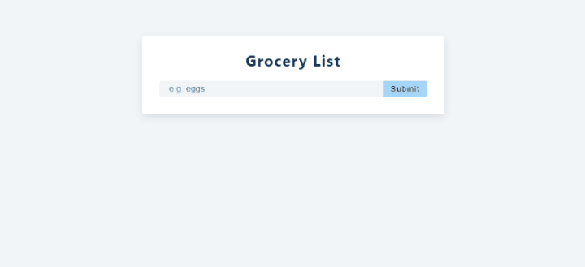

#### Homepage Screen

[view website](https://femi-ologunwa.github.io/10-react-grocery-listing/)



### Implementation

-  React icons.
-  A simple but detailed alert component.
-  Short-circuit conditional rendering of alert component.
-  Ternary operator conditional rendering of button text.
-  Creating a unique id for an item with:

```javascript
new Date().getTime().toString();
```

-  Using template string in the conditional naming of a class.
-  Hiding a component after display for 3s - useEffect cleanup process.
-  Functionality to add, delete, update a list of items.
-  Saving and updating a list of items in local storage in real time
